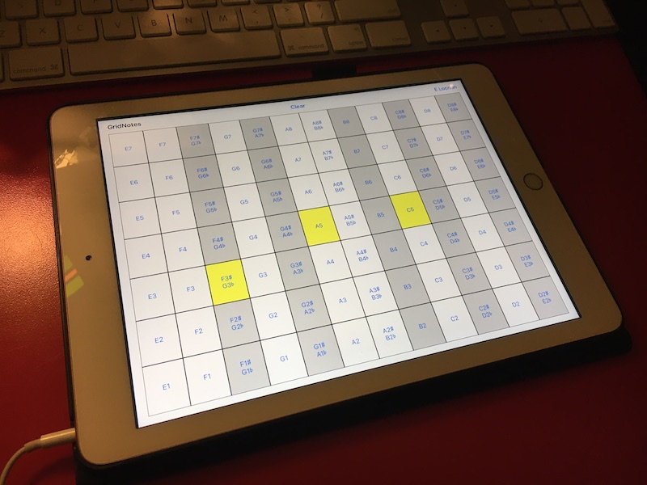
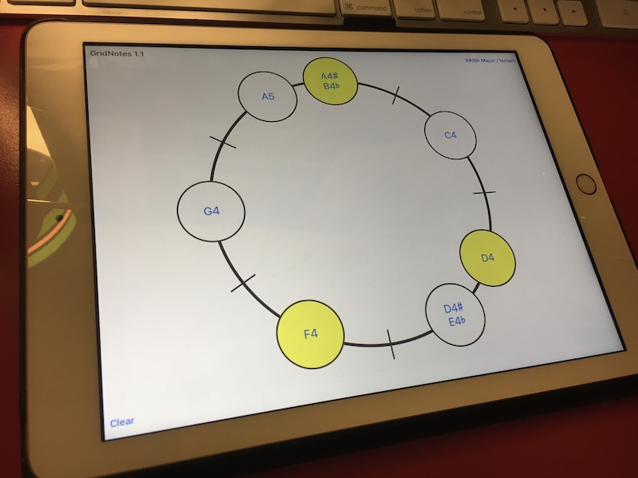

# GridNotes

A piano with a grid layout (iOS)

Now available (for free) in the iOS AppStore for iPhone and iPad!  https://apps.apple.com/us/app/gridnotes/id1548202128

## Changelog

### 1.2.1

- Support iOS 15.

### 1.2

- Support dark-mode.

### 1.1

- Implement "Ring" keyboard layout.
- Use AVAudioSession `.mixWithOthers` option, which allows the piano to play over the audio of other apps.
This allows GridNotes to be used in conjunction with e.g. a metronome app or while listening to a backing track on YouTube.
- Remove Sine Wave sound font (all of the notes were at the wrong pitch).

### 1.0

- Initial release.

## Credits

GridNotes includes instruments from the [Fluid R3 Soundfont](https://member.keymusician.com/Member/FluidR3_GM/index.html), which was created by Frank Wen and is distributed under the MIT license.
